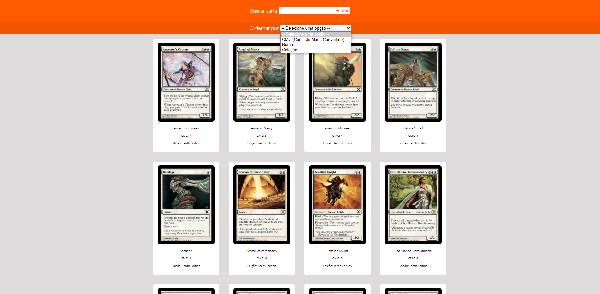
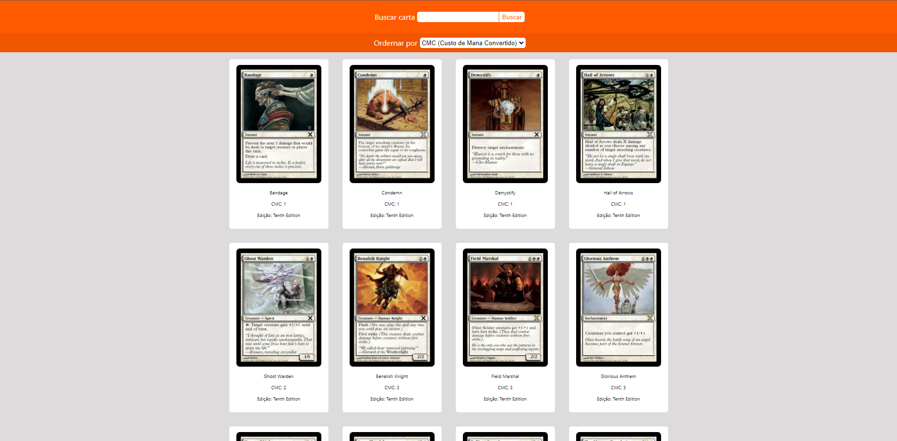

# MTG Searcher

**Número da Lista**: 4<br>
**Conteúdo da Disciplina**: D&C<br>

## Alunos
|Matrícula | Aluno |
| -- | -- |
| 16/0127891 |  João Vitor de Moura Rosa Silva |
| 16/0016169  |  Nícalo Ribeiro |

## Sobre 
O objetivo do projeto é mostrar o uso do MergeSort, que é uma forma de ordenação que segue o princípio de Divisão e Conquista. Para tal, criamos um mecanismo de pesquisa de cartas de 'Magic, the Gathering'. A partir das cartas pesquisadas e dispostas na tela, é possível ordená-las de acordo com o atributo desejado. Para realizar a busca das cartas, utilizamos a [MTG Api](https://docs.magicthegathering.io/).

## Vídeo de apresentação
[Vídeo de apresentacao](utils/ProjetoDeAlgoritmosD-C-Dupla30.mp4)  
Caso o link não funcione, o vídeo está dentro da pasta 'utils' e tem o nome de 'ProjetoDeAlgoritmosD-C-Dupla30'
Link do one drive: [Vídeo de apresentação](https://unbbr-my.sharepoint.com/:v:/r/personal/160016169_aluno_unb_br/Documents/Grava%C3%A7%C3%B5es/Projeto%20de%20Algoritmos%20D-C%20-%20Dupla%2030-20220328_204920-Grava%C3%A7%C3%A3o%20de%20Reuni%C3%A3o.mp4?csf=1&web=1&e=qfp36x)
## Screenshots





## Instalação 
**Linguagem**: Javascript<br>
**Framework**: ReactJs<br>
**Requisitos**: npm ou yarn

## Uso 
```
npm install OU yarn install
```

```
npm start OU yarn start
```


